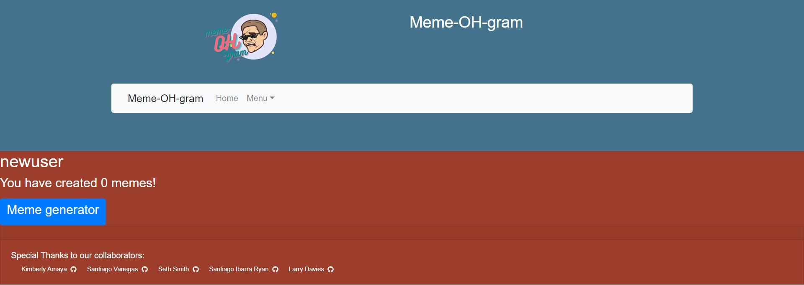

# meme-OH-gram

## Description
  Meme-OH-gram uses graphQL API built with Apollo Server. The app was built using the MERN stack, with a React front end and MongoDB database. End users can browse through and like memes displayed on the home page. These are memes generated by all users of meme-OH-gram. Once logged in a user can create and share memes while building their own library of memes.

  ## Table of Contents
  [Installation](#Installation)  
  [Usage](#Usage)  
  [Contributing](#Contributing)   
  [Testing](#Testing)  
  [Questions](#Questions)  
  [License](#License) 
  
  ## Installation
  1. See Contributing for forking the repo
  2. Once these files are local on your machine
  3. In the root of the directory run 'npm install' in the terminal to create the necessary dependencies
  4. Navigate into the client folder and run 'npm install' in the terminal to create the necessary dependencies
  5. Navigate into the server folder and run 'npm install' in the terminal to create the necessary dependencies
  
  ## Usage
  ### on local machine
  1. In the root of the directory run 'npm run develop' to run the application
  2. The browser will automactically open to http://localhost:3000
  3. You have options to browse through and like memes, login, signup, create new memes, and logout. See steps 2 thru 14 below "on Heroku" for more detail
  4. Once satisfied return to bash and disconnect by typing ctrl + c on your keyboard

  ### on Heroku
  1. Follow this link to the application: https://meme-oh-gram.herokuapp.com/
  2. Browse through memes and like memes
  

  3. Use the Menu drop down to navigate to Sign Up
  4. Enter your username, email and password
  5. Press Submit
  

  6. You'll be routed to your profile page, here you'll see your generated memes
  7. Press the Meme generator button
  

  8. You'll be routed to the meme generator page
  9. Here you can enter captions for the meme pictured or you can press Next Meme to get another image
  10. Once satistfied with the image and the caption press Create 
  

  11. You'll see the generated meme with three button options  
    * Press Create New Meme to go back and generate another meme  
    * Press Copy To Clipboard to copy the url to the image to share on other sites  
    * Press Save Meme to save this meme to your profile  
  

  11. Continue creating and saving new memes
  12. To see your saved memes you'll have to navigate to https://meme-oh-gram.herokuapp.com/profile/\<username>
  

  13. Lastly to logout use the Menu drop-down to select logout
  14. You'll be routed back to the home page
  

  ## Contributing                                                                                                
  
  ### Add to Project  
  To work on or add to this project follow these steps  
  1. Fork the repository  
  2. Add you changes  
  3. Submit a pull request for approval  
  
  ### Issues
  To add issues in GitHub follow these steps
  1. Click on the issues tab
  2. Click 'New issue' button
  3. Give the issue a title and comments
  4. Click 'Submit new issue' button

  [Click here to view current GitHub Issues](https://github.com/kimberlyamaya/meme-OH-gram/issues)   

  ## Testing

  ### Test Authentication on profile page
  1. Before you log in and make sure you're logged out 
  2. Go to profile from the menu drop-down  
  3. You'll get a message you need to sign up to access  

  ## Questions

  ### Contact
  For any questions please contact  
    * Kimberly Amaya || [Kimberly's GitHub](https://github.com/kimberlyamaya)  
    * Santiago Venegas || [Santiago V. GitHub](https://github.com/santiagov916)  
    * Seth Smith || [Seth's GitHub](https://github.com/Seth20smith)  
    * Santiago Ibarra Ryan || [Santiago I. GitHub](https://github.com/SantiBass)  
    * Larry Davies || [Larry's GitHub](https://github.com/Lssdavies)  
  
  ## License
  This project contains a license from MIT 
  [Click here to see the license](license.md)
   